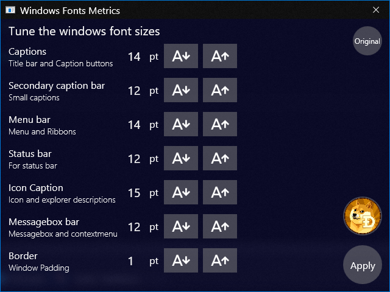

# WindowsFontMetrics
Free and Open Source Tune windows fonts sizes.

With this windows app that you do not need to install, you can tune each font size for the title bar, file explorer icons and folder descriptions, the fonts in the ribbon and menu bars, and the padding of the border to grab it easier.

Click on releases to download (upper right area)
