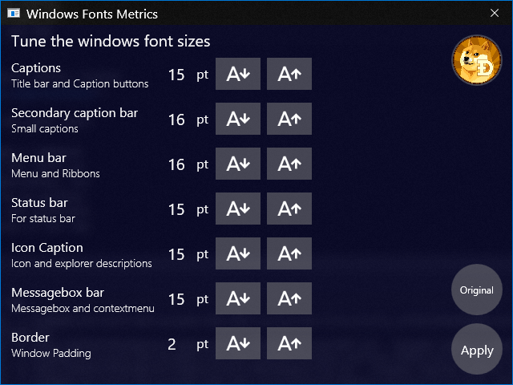

# WindowsFontMetrics
This app is great for big monitors and tired eyes.

Free and Open Source Tune windows fonts sizes.

Tune each font size for the title bar, file explorer icons and folder descriptions, the fonts in the ribbon and menu bars, and the padding of the border to grab it easier.

Click on releases to download (upper right area), unzip and run.
